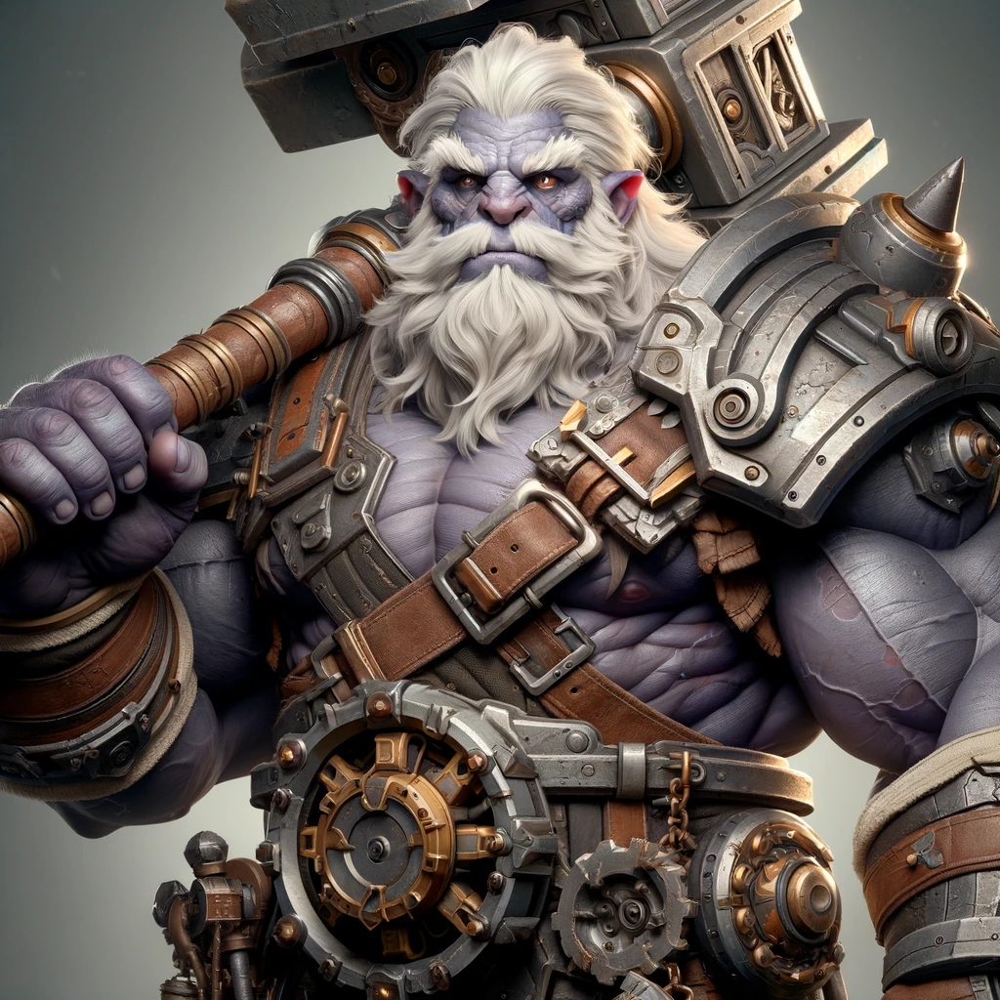

---
{"publish":true,"path":"1. The World/2 NPCs/Enemies/Gunner Ironford.md","permalink":"/1-the-world/2-np-cs/enemies/gunner-ironford/"}
---

> [!infobox]
> # `Gunner Ironford` 
> 
> ###### Bio
> Type |  Stat |
> ---|---|
> Race | Duergar Dwarf | 
> Sex | Male | 
> Age | `=this.age` |
> Condition | Healthy |
> ######  Information
> Type |  Stat |
> ---|---|
> Current Location | Unknown |
> Class | `=this.class` |
> Alias(es) | `=this.aliases` |
> Known Family | |
> Known Groups | [[1. The World/2 NPCs/Groups/The Savage Seven\|The Savage Seven]],[[1. The World/2 NPCs/Groups/Church of Le Duegar\|Church of Le Duegar]] |
 
# `Gunner Ironford`
## History

### Current Activities

### Personality Traits

## Associates

### Relation to The Remnants 

## Known Stats
**Gunner - was supposed to keep Sundara from being branded in prison but failed to do so, was also supposed to kill Cassius as soon as he got in prison but didn’t**
**

giant Duragar that is the self proclaimed ruler of the Underhoard. 12ft tall 10ft wide

**
not a fan of [[2. The Remnants/Cassius\|Cassius]] 
  **- Gunner is influencing the Church of Le Deguar and is puppeteering the warden, if he is found guilty he will be executed**
arch bishop moved against him
**Gunner Ironford - One of the Savage Seven; has a hammer with a rounded compressed clockwork device at the head**